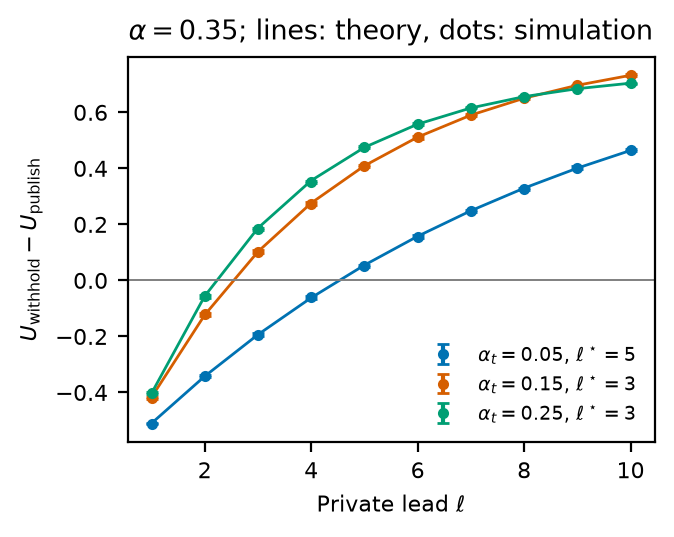
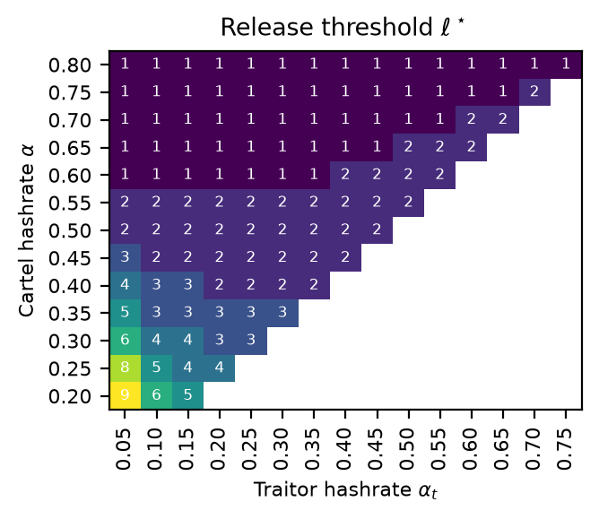
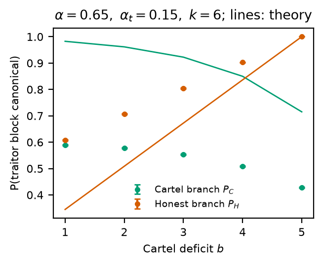
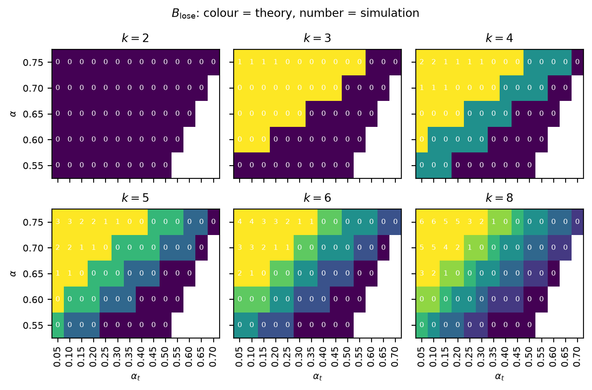
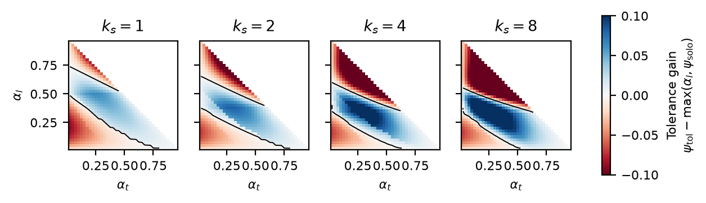
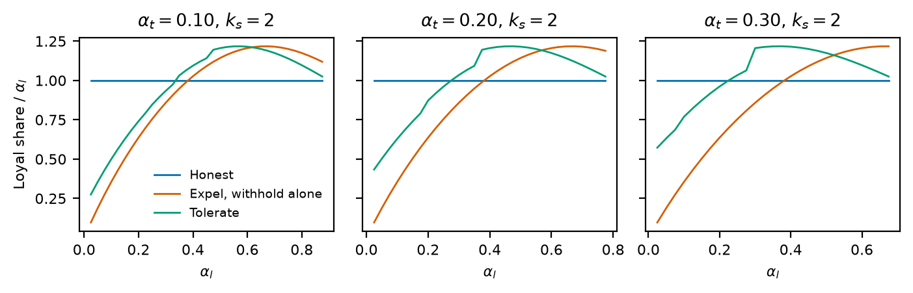

# Cartel: a starter–follower model of collusive withholding

Code for *A Starter–Follower Model for Collusive Withholding Attacks* (`Cartel.pdf`).

A mining cartel shares a private chain. Its **loyal** members (hashrate `α_l`)
follow the attack plan. A **traitor** (hashrate `α_t`) keeps the cartel's
information but decides for itself, block by block, what pays best. Honest
outsiders hold `1 − α`, where `α = α_l + α_t`. All rewards are counted in
canonical blocks. The tie-breaking parameter is `γ = 0` throughout.

| Script         | Paper | Question                                                                                         |
| -------------- | ----- | ------------------------------------------------------------------------------------------------ |
| `release.py`   | §4    | The traitor just mined a private block at lead `ℓ`. Should it publish now or keep it hidden?     |
| `stubborn.py`  | §5    | The cartel branch trails by `b` blocks. Should the traitor keep mining on it?                    |
| `tolerance.py` | §6    | The traitor betrayed. Should the loyal miner keep sharing information with it or expel it?       |

`theory.py` holds the closed forms (equation numbers refer to the paper), and
`common.py` holds the parallel Monte Carlo runner and plotting helpers.

## Run

```bash
pip install -r requirements.txt
cd cartel
python release.py         # simulate, write results/release.csv, plot
python release.py plot    # replot from the saved CSV only
```

`release.py` takes about 15 s and `stubborn.py` about 1 min on 12 cores.
`tolerance.py` takes a few seconds because it solves Markov chains exactly.
Each grid point is simulated in 30 independent seeded runs, and the error bars
are 95% confidence intervals. The results (CSV and PNG) are committed in
`results/`.

## Results

### §4 Release threshold ℓ*

Withholding beats publishing once the private lead reaches `ℓ*` (Theorem 1).
The simulated utilities match the closed form at every grid point.

 

### §5 Stubborn participation threshold B_lose

`theory.b_lose` uses the closed-form diagnostic (Eq. 35). In it, the value `σ`
of catching up is approximated by a random walk that reaches lead `M = 2`
before deficit `k`. The simulation plays the whole fork out instead: stubborn
mining until catch-up, then Eyal–Sirer selfish mining.

The two disagree. Theory and simulation give the same `B_lose` on 155 of 360
grid points, and on every other point the simulation's `B_lose` is smaller.
The cause is the hidden tie at `b = 0`. In the closed form, the cartel keeps
mining stubbornly after an honest block. In the simulated Eyal–Sirer phase,
that honest block ends the fork. The paper's exact `σ_B` (Eqs. 17–18) and the
self-consistent cutoff (Theorem 2) are not implemented yet.




### §6 Tolerate or expel

This is the exact Markov reward chain of `k_s`-capped selfish mining (§6.1).
Its states record who owns each hidden block, and the traitor publishes
whenever its new block leaves a lead below `ℓ*`. The loyal miner's long-run
canonical share is `ψ_tol` when it tolerates the traitor. After expulsion, it
gets `max(α_l, ψ_solo)`, the better of honest mining and withholding alone.

Blue marks where tolerating pays (Theorem 3). Bottom left, honest mining is
best. Top right, a strong loyal miner does better alone than with a traitor
that keeps disclosing. With `α_t = 0`, the chain reproduces the Eyal–Sirer
revenue formula.




The stubborn-plus-selfish tolerance chain (§6.2) is not implemented.
