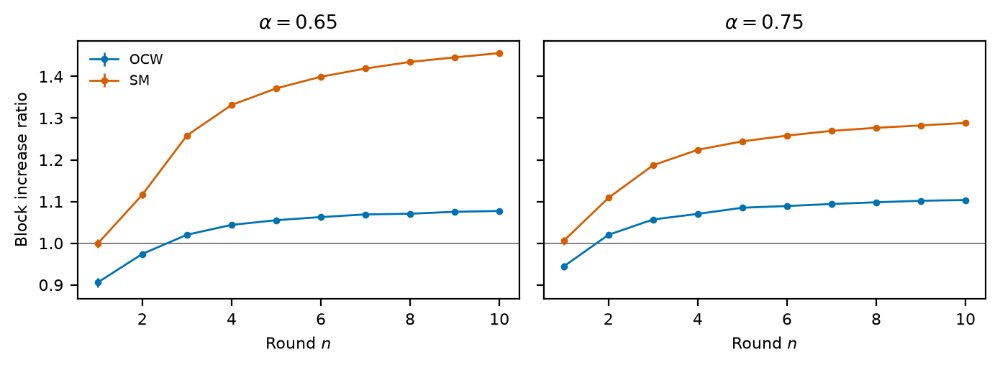
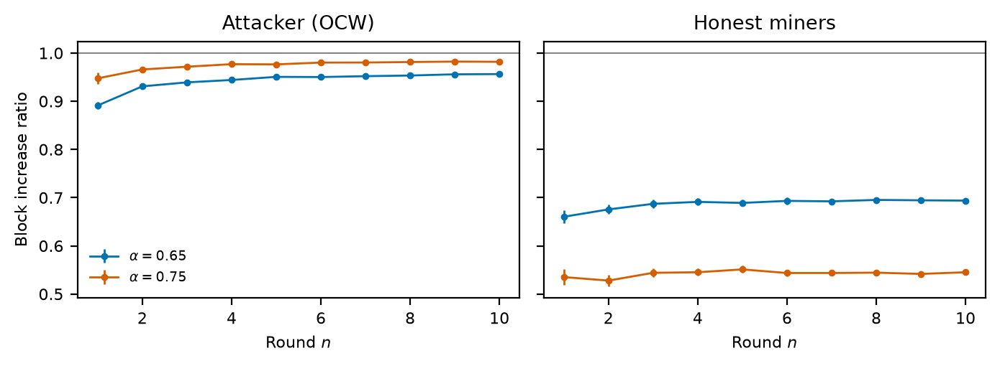

# OCW: one-block-capped withholding

Code for *One-Block-Capped Withholding* (`BlockWithholding_PoW.pdf`). An
attacker with hashrate `α` competes with honest miners holding `1 − α`.

**OCW.** When the attacker mines a block first, it keeps that one block
private for at most a withholding window `w`. Three things can happen next:

- **The window runs out.** The attacker publishes the block.
- **The attacker mines again first.** It publishes the held block, holds the
  new one, and restarts the window.
- **An honest block comes first.** The two blocks race. The attacker wins if
  it mines the next block; otherwise it abandons its block.

So no orphan chain is ever longer than one block.

**Model.** Time is measured in target block intervals `T`. Blocks arrive as
a Poisson process with rate `1/D`, where `D` is the difficulty. Publishing is
instant, and the longest chain wins; between two equal-height tips, the one
published first wins (`γ = 0`). A block counts only if it ends up on the
canonical chain. Unless stated otherwise, `w = 10T`.

| Script         | Paper     | What it measures                                                             |
| -------------- | --------- | ---------------------------------------------------------------------------- |
| `share.py`     | Fig. 3, 4 | Attacker share of canonical blocks and orphan rate, against Eq. 2 and Eq. 25 |
| `rounds.py`    | Fig. 5, 6 | Canonical blocks over 10 difficulty rounds, OCW vs selfish mining (SM)       |
| `collusion.py` | §6        | A three-pool OCW cartel whose traitor publishes every block at once          |

`chain.py` is the event-driven simulator: a published block tree, the OCW
attacker or cartel, and difficulty adjustment (DAA).

## Run

From the repository root, `python -m ocw.share` simulates, writes
`results/share.csv`, and plots. Add `plot` to only replot. Each script takes a
few seconds. Every point averages 30 seeded runs, and the error bars are 95%
confidence intervals.

## Results

**Share and orphan rate (Fig. 3, 4).** OCW raises the attacker's share only
above `α = 1/2`, and the gain grows with `w`. The simulation matches the
closed forms within the confidence intervals.

**Difficulty rounds (Fig. 5, 6).** A round is `2016 T` of wall-clock time.
The block increase ratio divides a miner's canonical blocks after `n` rounds
by what it would earn mining honestly, `hashrate · n · 2016`.

If the DAA counts only canonical blocks, OCW starts below 1 and gains 8–10%
after 10 rounds. Selfish mining gains more: with `α > 1/2` its private chain
always stays ahead, so all its blocks become canonical and the DAA sees
attacker blocks only.

If the DAA counts every published block, orphans included, OCW stays below 1,
and honest miners lose far more.

**Collusion (§6).** The paper leaves open whether several pools can form a
stable OCW cartel. Here a loyal pool (0.3) and a traitor pool (0.3) run OCW
against honest miners (0.4); the traitor publishes its own blocks at once. If
the loyal pool always tolerates this, the traitor ends up with more than its
hashrate (0.336) and the loyal pool with less (0.289).

