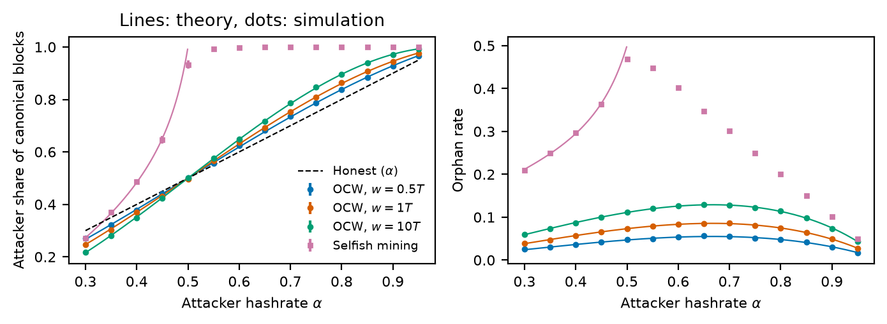
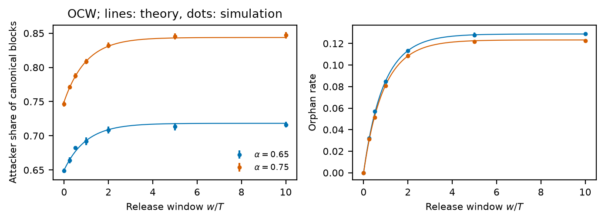
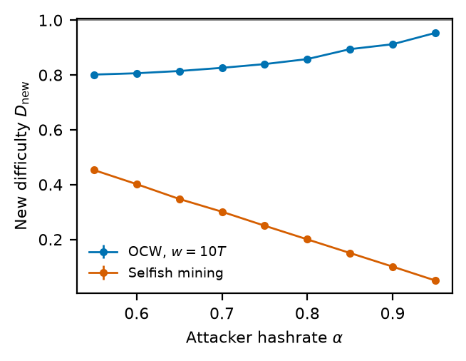
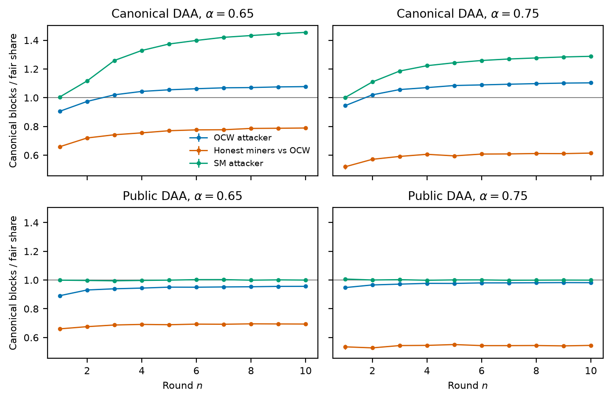
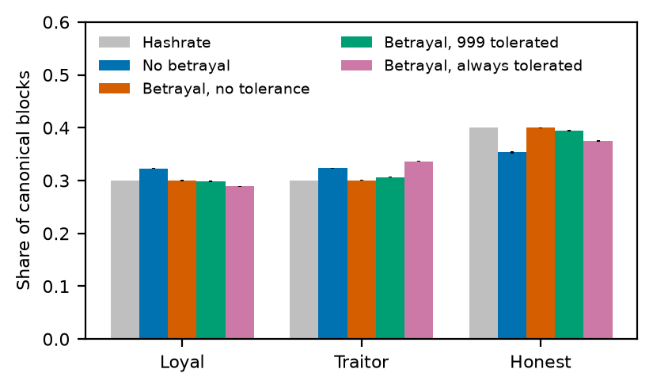
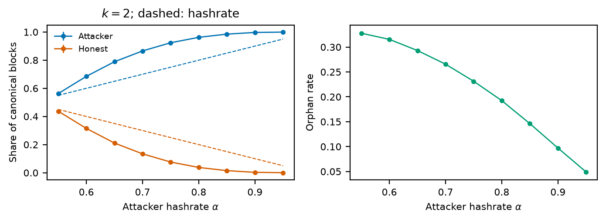
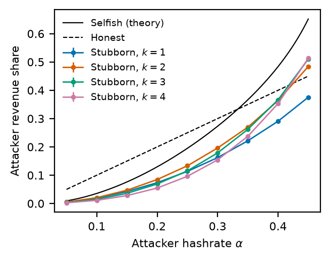

# OCW: one-block conditional withholding

Simulations of OCW and related withholding strategies in proof-of-work
mining. An attacker with hashrate `α` competes with honest miners holding
`1 − α`.

**OCW.** When the attacker mines a block, it keeps that one block private
for at most a release window `w`. Three things can happen next:

- **The window runs out.** The attacker publishes the block.
- **The attacker mines again first.** It publishes the held block and holds
  the new one.
- **An honest block comes first.** The two blocks race. The attacker wins if
  it mines the next block; otherwise the honest block wins.

**Model.** Time is measured in target block intervals `T`. Blocks arrive as
a Poisson process with rate `1/D`, where `D` is the difficulty. Publishing is
instant, and the longest chain wins; between two equal-height tips, the one
published first wins. Honest miners never follow the attacker in a tie
(`γ = 0`). A block counts only if it ends up on the canonical chain. Fees,
latency, network topology, and uncle rewards are left out.

| Script          | What it measures                                                                                               |
| --------------- | -------------------------------------------------------------------------------------------------------------- |
| `share.py`      | Attacker share of canonical blocks and orphan rate, OCW vs Eyal–Sirer selfish mining (SM), against theory      |
| `difficulty.py` | Difficulty after the first adjustment (2016 canonical blocks), OCW vs SM                                       |
| `rounds.py`     | Canonical blocks over 10 difficulty rounds, counting either canonical or all published blocks                  |
| `collusion.py`  | A three-pool OCW cartel whose traitor publishes every block at once                                            |
| `capped.py`     | Selfish mining with at most `k = 2` private blocks                                                             |
| `stubborn.py`   | k-deficit stubborn mining                                                                                      |

`chain.py` is the event-driven simulator: a published block tree, the OCW
cartel, and difficulty adjustment (DAA). It also holds a counting version of
Eyal–Sirer selfish mining. `theory.py` holds the closed forms.

## Run

From the repository root, `python -m ocw.share` simulates, writes
`results/share.csv`, and plots. Add `plot` to only replot. Each script takes a
few seconds. Every point averages 30 seeded runs, and the error bars are 95%
confidence intervals.

## Results

**Share and orphan rate.** OCW pays only above `α = 1/2`, and the gain grows
with the window `w`. The simulation matches the closed forms in `theory.py`.

**Difficulty.** After one epoch, OCW lowers the difficulty to about 0.8–0.95.
Selfish mining with `α > 1/2` lowers it to about `1 − α`, because few of its
blocks become final.

**DAA rounds.** Each ratio divides a miner's canonical blocks after `n`
rounds by its fair share, `hashrate · n · 2016`. If the DAA counts only
canonical blocks, OCW gains about 8–10% over its fair share after 10 rounds.
If it counts every published block, orphans included, OCW stays below its
fair share. Selfish mining with `α > 1/2` is modelled the way the original
study did: the attacker publishes in 2016-block batches, so all of its blocks
become canonical and all honest blocks are orphaned.

**Collusion.** When the loyal pool always tolerates the traitor, the traitor
ends up with more than its hashrate (0.336) and the loyal pool with less
(0.289).

**Capped and stubborn variants.**

 
